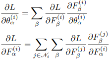

Some general remarks:

- **Lab1/2** (Intro 1/2)

  I’ve updated these labs to remove deprecated warnings and refactored some functions for more
  idiomatic NumPy usage.

  A minor criticism is the absence of type hints in function signatures. In my opinion, type hints
  significantly improve code readability, especially in a learning context.

- **Lab 3/4/5** (RBM + CDK / PCD / DBN + Momentum)

  Combining weights and biases into a single matrix is, in my view, a poor design choice. It’s
  error-prone and complicates indexing logic. I refactored the implementation to separate weights
  and biases, which makes the code clearer and less fragile. The implementation of the CDK/PCD is
  much cleaner imo than the exemplary solutions that I've seen (especially the refined one in
  [`nncore.ebm`](../../src/nncore/ebm.py) module).
  
  Additionally, I found the imperative style of the RBM implementation limiting. Python supports OOP
  well, so defining RBM/DBN classes that encapsulate both data and behavior would be more elegant
  and maintainable. I was too lazy ot change the entire lab code at the time, but you can see an
  improved version in the [mnist_dbn.ipynb](../mnist_mlp.ipynb) notebook.

  One minor nitpick: naming conventions like `positive_hidden` feel clunky and overly verbose. Given
  that the lectures use clean and fairly standard mathematical notation, I believe it's acceptable
  (and even preferable) to use one-letter variable names in code that directly mirrors mathematical
  formulations.

- **Lab 6/7/8** (MLP + Backprop / MLP + DBN pretraining / MLP + ReLU)
  
  The original backprop implementation is, frankly, quite poor. It suffers from all the previously
  mentioned issues: imperative structure, poor naming, and lack of type hints; making it hard to
  read or extend. While the notebooks contain some improvement, the fully refined version in
  [`nncore.nn._layer`](../../src/nncore/nn/_layer.py) is significantly cleaner and more
  maintainable.
  
  As a side note, I believe the backpropagation algorithm could be presented better in lectures. The
  formulation (likely from Bishop) is somewhat outdated. In reality, backprop is just the chain rule
  applied to a computational graph and can be distilled into two key equations:
  
  

  where $L$ is the loss function, $F(\cdot;\theta)$ is a layer (node in the computation graph),
  $\mathscr{N}_i$ is the set of downstream nodes from the node $i$ and $\alpha$, $\beta$ are some
  multi-indices which index the corresponding tensors.

- **Lab 9** (MLP + Dropout)

  This lab further illustrates the downsides of the proposed imperative approach. Implementing
  dropout requires excessive boilerplate and workaround logic. With an OOP-based design, adding
  dropout is as simple as writing a new Dropout layer class which is ~30 loc.
  

- **Lab 10/11** (AE / AE + Nesterov)

  No new criticisms, but a practical tip: if you use proper initialization for the sigmoid
  activation (i.e. Xavier initialization) then the AE learns even without DBN pretraining (although
  resulting loss may be slightly higher compared to the pretrained case).

- **Lab 12** (CNN)

  This lab finally introduces an implementation style I find much more agreeable. The imperative
  style is mostly replaced. I significantly rewrote the `Conv2D` class, simplifying the `im2col`
  logic using built-in NumPy operations, which reduced code complexity substantially.
  
- **Lab 13** (Word2Vec)

   